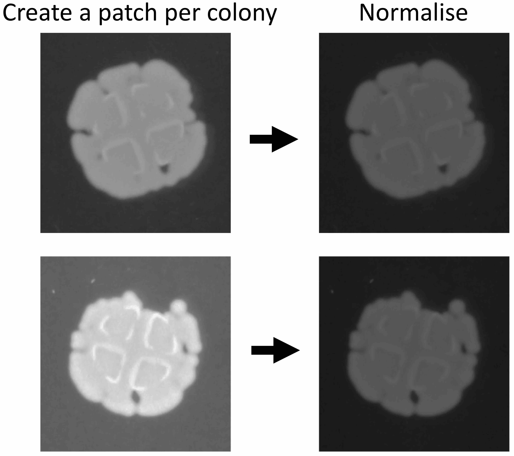

# BaColonyzer algorithm

## Grid location

BaColonyzer starts the analysis by finding the location of the grid. For that, it imports the grayscale version of the last image in series, which is used to generate a histogram of intensity values.

Since the last image contains well defined colony spots, the histogram shows two high peaks corresponding to the intensity values of the agar and the colonies (Figure 1).

{width=85%}

**Figure 1.** Last image is imported in grayscale and colors of spot
and agar are retrieved from a histogram of intensity values.

The intensity values are used to create an artificial image of the plate (template), for which users need to input the number of rows and columns of the grid. Resizing and changing the position of this template allows to find the best match with the actual grayscale image (Figure 2). The best match will be the one with the lowest normalised squared difference [(The OpenCV Library)](https://docs.opencv.org/4.0.0/df/dfb/group__imgproc__object.html).

{width=99%}

**Figure 2.** Normalised squared difference is used to find the best match
between a template of the plate and the last image.

Once the best match is found, BaColonyzer is able to predict the location of the whole plate and to ignore those parts of the image that might introduce noise (e.g. the borders). Removal of the useless pixels, followed by automatic thresholding using Otsu binarization [(The OpenCV Library)](https://docs.opencv.org/3.4.3/d7/d4d/tutorial_py_thresholding.html), allows the users to get the position of the spots and the agar (Figure 3).

{width=80%}

**Figure 3.** Removal of plate borders and Otsu binarization are used to locate
the agar and the colonies.

## Image analysis

Each of the images in series is imported in grayscale and the plate borders are removed. Colony areas are computed using the Otsu binarization [(The OpenCV Library)](https://docs.opencv.org/3.4.3/d7/d4d/tutorial_py_thresholding.html).

In order to ensure an accurate analysis of each colony, BaColonyzer divides the agar plate into smaller patches that contain one colony spot. By default, the tool normalises the intensity values of each patch by subtracting the mean intensity of the agar in this patch, thus correcting for colour differences within and between images (Figure 4).

{width=55%}

**Figure 4.** BaColonyzer divides the plate into patches containg colony spots.
Each patch is normalised by subtracting the color of the agar.

Cell density of the colonies is then computed as the sum of all intensity values of the patch, divided by the number of pixels. Results are also normalised (divided by 255) to be in range 0-1.

**Enjoy using BaColonyzer!**
