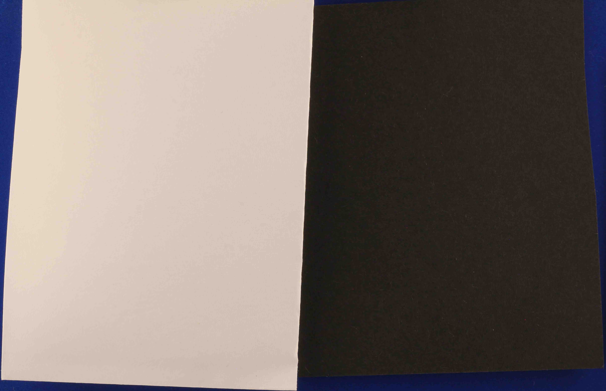

# BaColonyzer algorithm

## Grid location

BaColonyzer starts the analysis by finding the location of the grid. For that, it imports the grayscale version of the last image in series, which is used to generate a histogram of colors. Colors are represented as intensity values, from 0 to 255.

Since the last image contains well-defined colony spots, the histogram usually shows two high peaks: the highest peak corresponds to the color of the agar, while the second peak shows the color of the colonies (Figure 1). As a quality check, BaColonyzer ensures that the color intensity of the colonies falls between 70% of the maximum color of the picture (upper bound) and twice the color of the agar (lower bound). Otherwise, it sets the color intensity of the colonies to be within this range.

{width=85%}

**Figure 1.** Last image is imported in grayscale and colors of spot
and agar are retrieved from a histogram of intensity values.

The intensity values of agar and spots are used to create an artificial image of the plate (template), for which users need to input the number of rows and columns of the grid. Resizing and changing the position of this template allows to find the best match with the actual grayscale image (Figure 2). This is achieved by computing the lowest normalized squared difference [(The OpenCV Library)](https://docs.opencv.org/4.0.0/df/dfb/group__imgproc__object.html).

{width=99%}

**Figure 2.** Normalised squared difference is used to find the best match
between a template of the plate and the last image.

Once the best match is found, BaColonyzer is able to predict the location of the whole plate and to trim those parts of the image that might introduce noise (e.g. the borders). Image trimming, followed by automatic thresholding using Otsu’s binarization [(The OpenCV Library)](https://docs.opencv.org/3.4.3/d7/d4d/tutorial_py_thresholding.html), allow to get the position of the spots and the agar (Figure 3).

{width=80%}

**Figure 3.** Removal of plate borders and Otsu binarization are used to locate
the agar and the colonies.

## Image analysis

Each of the images in series is imported in grayscale and trimmed based on the grid location that has been previously computed. Colony areas are computed using the Otsu's binarization [(The OpenCV Library)](https://docs.opencv.org/3.4.3/d7/d4d/tutorial_py_thresholding.html).

By default, color intensities of the image are also normalised (divided by 255) to be in range 0-1. Alternatively, in order to compare different series of time-lapse images, BaColonyzer allows the users to provide a reference picture for the normalization. This must be an image showing a white and black paper next to each other, and must be taken using the same camera settings as the image series (Figure 4). The reference image is imported in grayscale and the color intensities are clipped at 1%-99% quantiles to exclude outiliers or noise. The resulting minimum and maximum intensity values (black and white, respectively) are taken to calibrate the color intensities of images using the expression below:

$NI = \frac{OI - min_{ref}}{max_{ref} - min_{ref}},$

where NI are the new intensity values of each image, OI are the original values,
$min_{ref}$ is the intensity of the black color, and $max_{ref}$ is the intensity of the white color.

{width=55%}

**Figure 4.** Example of a reference image. Black and white papers allow to
normalize the results accounting for different camera settings.

Next, in order to ensure an accurate analysis of each colony, BaColonyzer divides the agar plate into smaller patches that contain one colony spot. By default, the tool adjusts the intensity values of each patch by subtracting the mean intensity of the agar in this patch, thus correcting for color differences within and between images (Figure 5).

{width=55%}

**Figure 5.** BaColonyzer divides the plate into patches containg colony spots.
Each patch is normalised by subtracting the color of the agar.

At the end, BaColonyzer provides a big table with statistics of each colony, including colony mean, colony variance, background mean, and background variance. Normalized intensity values of each patch (NI) are computed as the sum of all intensity values of the patch, divided by the number of pixels. Results are stored as Output Data. Furthermore, in order to visually check that the grid location was achieved properly, BaColonyzer provides some Output Images. These are binary images resulting from an Otus’s Binarization [(The OpenCV Library)](https://docs.opencv.org/3.4.3/d7/d4d/tutorial_py_thresholding.html), which is performed after the trimming step to let the users check whether the grid location was successful.  

## Flowchart

A flowchart showing the algorithm of BaColonyzer is found below:

{width=99%}

**Figure 6.** Flowchart of BaColonyzer algorithm.

**Enjoy using BaColonyzer!**
